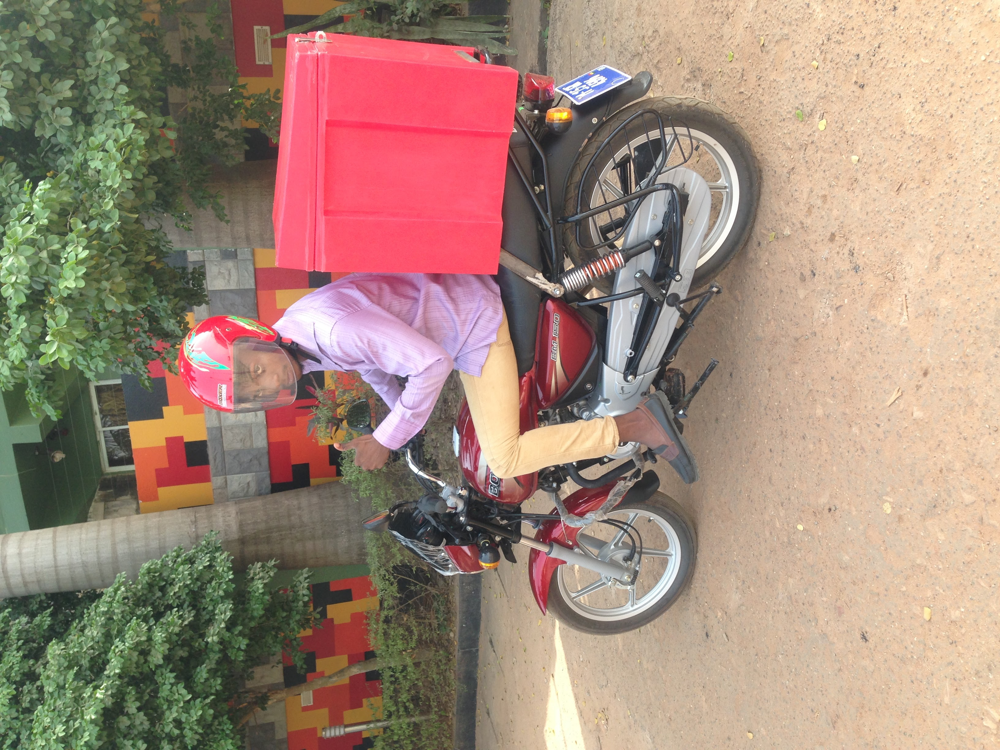

It's been 12 years since I started writing software. Software to me has always
been a means to an end. However, I didn't start writing software because I wanted to be a software engineer. I started
writing software because I was an entrepreneur with a problem. An ecommerce problem.

Ecommerce in Ghana started with Google in 2009. Yes, Google lit the ecommerce spark in Ghana and a few other African countries
with their Google Trader initiative. Google Trader was just a classifieds website, but at the time it was so
empowering. It was the first time anyone could sell online. I was in university at the time with a side business
reselling, jailbreaking and repairing iPhones. This is how I bought my first car. Good times!

However, even though it was better than what we had before I still felt something was missing. Ghanaian ecommerce needed a
more comprehensive solution. The problem with classifieds is the seller still had to handle payments and deliveries manually. In
2011, I was just about graduating university and I decided to learn software development to be able to build the solution to the ecommerce problem.
2 years later, I had built my first web app, a food order platform and approached some restaurants.

Within the very first meetings I discovered that ecommerce had a trifecta. A comprehensive ecommerce solution needs 3 ingredients;
orders, payments and delivery. At the time, Ghanaian ecommerce startups totally lacked infrastructure for 2 out of these 3 problems; payments and deliveries.
Integrating payments led me to meet one of my favorite people, "Dr" Alfred Rowe (founder of [eGotickets](https://egotickets.com)). Alfred had built the
first Ghanaian payment system, MPower Payments, and I was lucky to be able to join on that ride. Seeing that the payments problem was solved I
decided to take a crack at the delivery problem. In 2016, I started the first mobile on-demand delivery service, Ukuul. Ukuul never
had a problem with demand however our business model to own the motorcycles was expensive and meant it was harder for us to scale it quickly to meet demand.
Yes, we should have pivoted sooner among other things, however that is a topic for another day. Ukuul folded in 2018. 

I went on to work for some amazing companies doing other things thinking someone will definitely come along and solve the ecommerce problem.
However, it's been 5 years and I still see no such solution in sight. 2 years ago I got intrigued by a new breed of sellers who
use social media primarily as their storefront. I wanted in on the action, so I opened an IG shop [BorgaGoods](https://instagram.com/borgagoods.shop) ([old account](https://instagram.com/borgagoods.gh))
and started selling stuff I found useful that I sourced from China. To my surprise this business turned out to be profitable
even though we didn't have a website! However, I wasn't surprised. During my Ukuul days most of our most valuable
customers were exactly this type of merchant. It got me thinking. What if we built a solution for merchants to be able to
sell online by combining all the solutions from my experiences. What will that solution look like?

The shop will have to be a mobile first website.

Payments should be Mobile Money. 3 days escrow service for buyer safety.

Merchant/Sellers should be able to manage everything from a mobile app.

Deliveries should be integrated and fully managed with a focus on speed. The Ghanaian buyer is impatient.

Built ready for an AI future.

In February, earlier this year, all the stars aligned and we decided to tackle this problem head-on by building a platform
designed for the modern Ghanaian seller and buyer. It's been 8 months of long nights, but our initial version is finally ready for
the market.

Our goal is to empower a new breed of merchants that will create jobs and wealth that will benefit society at large.
Our delivery service is currently limited to Accra, but we will be expanding it to Kumasi then Takoradi soon. 

The company is Nuanom (means "brethren"). Our app is a few days away from getting listed on app store. 

Visit [nuanom.com](https://nuanom.com) to subscribe and learn more.